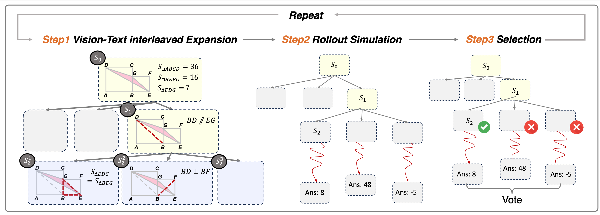
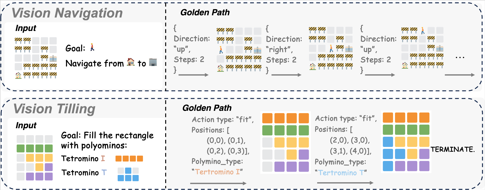

# VisuoThink: Empowering LVLM Reasoning with Multimodal Tree Search

<!-- <div align="center">
[💻 Code](https://github.com/ekonwang/VisuoThink) | [📃 Paper](https://arxiv.org/abs/2504.09130) | [🤗](https://huggingface.co/papers/2504.09130)
</div> -->

<div align="center">
<a href="https://github.com/ekonwang/VisuoThink">💻 Code</a> | <a href="https://arxiv.org/abs/2504.09130">📃 Paper</a> | <a href="https://huggingface.co/papers/2504.09130">🤗 Hugging Face</a>
</div>

Recent advancements in Large Vision-Language Models have showcased remarkable capabilities. However, they often falter when confronted with complex reasoning tasks that humans typically address through visual aids and deliberate, step-by-step thinking. While existing methods have explored text-based slow thinking or rudimentary visual assistance, they fall short of capturing the intricate, interleaved nature of human visual-verbal reasoning processes. To overcome these limitations and inspired by the mechanisms of slow thinking in human cognition, we introduce **VisuoThink**, a novel framework that seamlessly integrates visuospatial and linguistic domains. **VisuoThink** facilitates multimodal slow thinking by enabling progressive visual-textual reasoning and incorporates test-time scaling through look-ahead tree search. Extensive experiments demonstrate that **VisuoThink** significantly enhances reasoning capabilities via inference-time scaling, even without fine-tuning, achieving state-of-the-art performance in tasks involving geometry and spatial reasoning.

<!--  -->


## Quick Start

1. Install the dependencies:
```bash
conda create -n visuothink python==3.10 -y
conda activate visuothink

pip install -r requirements.txt
```

2. Set up the `config.py` file under `visual-navigation/` as follows:

```python
import os

# set up the agent max reasoning steps
MAX_REPLY = 10

os.environ["AUTOGEN_USE_DOCKER"] = "False"

MODEL_NAME = os.environ.get("MODEL_NAME", "gpt-4o")
API_KEY = os.environ.get("OPENAI_API_KEY")


llm_config={"cache_seed": None, "config_list": [{"model": MODEL_NAME, "temperature": 0.0, "api_key": API_KEY}]}
```

3. Run the visual navigation tasks:


- To run the visual navigation with VisuoThink, you can use the following command:

```bash
python visual-navigation/run_task_nav.py --verbose --visual
# alternatively, you can use the --tree_search flag to enable multimodal tree search
```

- To run the visual navigation with CoT with Executor, you can use the following command:

```bash
python visual-navigation/run_task_nav.py --verbose
```

- To run the visual navigation with CoT, you can use the following command:

```bash
python visual-navigation/run_task_nav.py --verbose --visual --run_tag cot
```

- To run the **geometry** tasks with VisuoThink (/wo rollout search), you can use the following command:

```bash
python geometry/solver.py
```


## Benchmarks

<!-- - Visual Tiling and Geometry (Geometry3k & Geomverse)'s Google Drive links will be available soon. -->
- (4.27 News) Geomverse Dataset has been released! See [here](dataset/geometry/Dataset_GeomVerse) for more details.

## Citation
Please consider citing our paper and starring this repo if you find them helpful. Thank you!
```bibtex
@misc{wang2025visuothinkempoweringlvlmreasoning,
      title={VisuoThink: Empowering LVLM Reasoning with Multimodal Tree Search}, 
      author={Yikun Wang and Siyin Wang and Qinyuan Cheng and Zhaoye Fei and Liang Ding and Qipeng Guo and Dacheng Tao and Xipeng Qiu},
      year={2025},
      eprint={2504.09130},
      archivePrefix={arXiv},
      primaryClass={cs.CL},
      url={https://arxiv.org/abs/2504.09130}, 
}
```